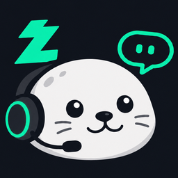
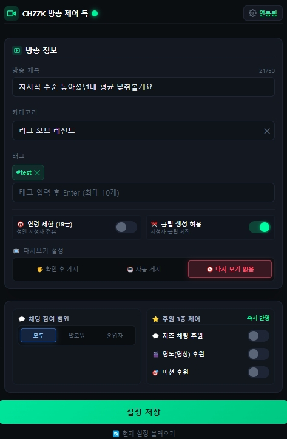
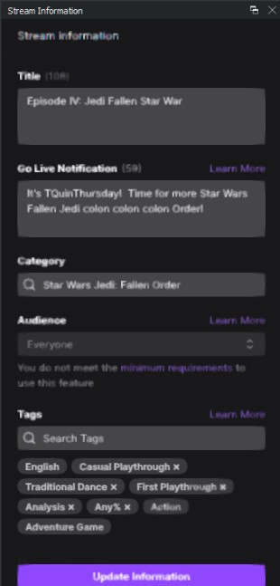

#  CHZZK OBS Dock
OBS Studio 안에서 사용자 브라우저 독(`http://localhost:8081`)을 추가하면 CHZZK 방송 정보를 편하게 수정할 수 있습니다.

과거 트위치 시절처럼 스트리머들이 치지직 스튜디오에 접속할 필요를 줄여주는 것이 목적입니다.
<figure align="center">
  
  
  <figcaption>(좌)Chzzk OBS Dock, (우)Twitch Info Dock</figcaption>
</figure>

> 현재 `v0.2.1-Beta` 버전입니다.

## 주요 기능

- 방송 제목·카테고리·태그 수정 (카테고리 실시간 검색 및 자동완성)
- 방송 세부 설정 변경
  - 19금 연령 제한
  - 클립 허용
  - 다시보기 설정 (확인 후 게시/자동 게시/다시 보기 없음)
- 채팅 설정 변경
- 후원 3종 ON/OFF
  - 채팅, 영상, 미션
- 트레이 아이콘
  - 독 주소 복사
  - 서버 종료
  - 시작프로그램 등록/해제 (테스트 중)
- 네이버 웹뷰 팝업 로그인(테스트 중)
> 테스트 중인 기능은 정상적으로 동작하지 않을 수 있습니다.

## 사용 방법

1. [Releases](../../releases)의 에셋에서 `chzzk-dock.exe`를 다운로드합니다.
> 버전명으로 인해 조금씩 다를 수 있습니다.
2. `chzzk-dock.exe`를 실행합니다.
3. OBS Studio에서 **보기 → 독 → 사용자 지정 브라우저 독**을 엽니다.
4. URL에 아래 주소를 입력합니다.
```text
http://localhost:8081
```
> 버전에 따라 주소는 변경 될 수 있습니다.
5. 열린 도크의 **⚙ 로그인 설정** 버튼에서 네이버 계정을 연동합니다.

이후 도크에서 방송 정보를 수정하고 **설정 저장**을 누르면 됩니다.

## 로드맵

### 버전
- [x] **v0.1.0-alpha**: 공식 API 기반 기본 기능 및 카테고리 검색 자동완성
- [x] **v0.2.1-Beta**: 비공식 API 전환
  - 네이버 쿠키 연동
  - 다시보기, 19금, 클립 설정
  - 채팅 참여 범위 및 후원 제어 기능 추가
- [ ] **v0.3.0**: UI 디자인 다듬기 및 1~4주간 사용자 피드백 반영
- [ ] **v1.0.0 (정식 버전)**: 안정화 버전
- [ ] **v2.0.0**: 백엔드를 마이그레이션 ([Python](https://www.python.org/) to [Go](https://go.dev/))

### 기능
  - **Chzzk 파티 만들기**
  - *커스텀 포트*
  - *후원 리모컨 독*
  - *중간 광고*
  - *스트림 상태*
  - *실시간 방송 통계*
  
보류 기능은 *기울임 표시*

## 참고

- OBS 독에는 `http://localhost:8081` 주소를 등록하여 사용합니다.
- `쿠키 정보(NID_AUT, NID_SES)`는 로컬 `config.json`에만 저장되어 치지직 API 통신에만 사용됩니다.
- 서버를 종료하려면 작업 표시줄 알림 영역의 아이콘을 우클릭한 뒤 **서버 종료**를 선택합니다.
- Antigravity와 Codex를 활용해 개발되었습니다.

## 문제 해결

실행 시 “포트를 사용할 수 없습니다”라는 오류가 보이면, 이미 실행 중인 `chzzk-dock.exe` 해당 포트를 사용중인지 확인 후 다시 실행하세요.